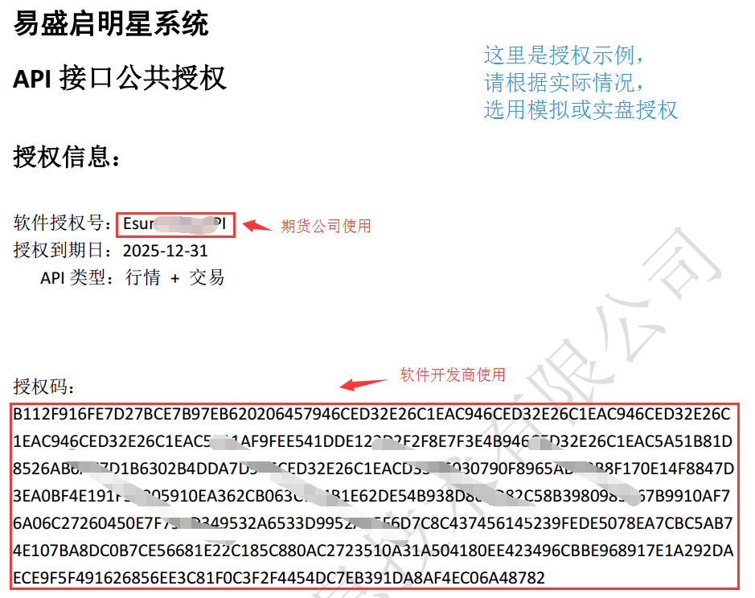

# 常见问题-共通

# 关于启明星（9.0）API的授权

## 为什么需要授权？

为了保证账户安全，启明星系统默认不开通用户的API访问权限。

如果客户想要通过API获取行情或者进行交易，必须向期货公司申请开通自己账户对应的API权限。

## 如何获取授权文件？

为了减少软件开发商和期货公司的工作复杂度，我们提供一个公共授权。所有的期货公司、所有的软件开发商共用一个公共授权（如果有特殊需要，可以单独申请）。

公共授权文件可通过`易盛的开发者中心`网站或者`启明星API开发者交流群(253509842)`QQ群获取。

目前公共授权文件有两个(到期日都为2025年12月31日)：

- 模拟：`启明星API测试授权码_2025年到期.txt`，软件授权号：Demo_Test
- 实盘：`启明星API授权证明_公共授权(实盘).pdf`，软件授权号：EsunnyTapAPI


## 授权码怎么用？
以实盘授权为例：



`软件授权号`：由期货公司使用，用于在后台配置用户的API授权。

`授权码`：有软件开发商使用，在初始化API时使用。

*注意：软件开发商使用的`授权码`为长度512字节的16进制字符串（无空格、无回车）。*

----------

# API基本上都需要SessionID,请问这个SessionID是从哪里可以得到？在那个API方法里传呢？

 有API和Notify两个接口类，API是提供给上层App的调用接口，Notify相当于Spi，由上层App实现。
每一次调用认为是一个Session,有唯一的一个SessionID。
App调用API请求类接口时，传入SessionID指针，API会返回一个值。
当服务器应答数据回来时，API通过Notify接口把对应的SessionID和应答数据一同返回。

----------

# 关于API的线程
 
 API的工作线程有：

- 线程1：缓存数据查询请求与应答线程，例如合约、品种信息等
- 线程2：Socket接收线程，用于返回服务器的实时应答
- 线程3：关键操作日志记录线程
- 线程4：API日志记录线程

----

# 登陆时，有哪些相关接口，调用时序是怎么样的？

调用接口：

- `SetHostAddress` :用于设置服务器IP、端口
- `Login`：填入用户名密码等信息，执行登陆

回调接口： 

- `OnConnect`：已经于服务器建立连接（未登录）
- `OnRspLogin`：如果errorCode为0，表示登陆成功，开始进行基础数据初始化；否则，返回错误原因，需重新登陆。
- `OnAPIReady`：API基础数据初始化完成，可以进行业务接口调用


``` sequence
Application->TapAPI: SetHostAddress
Application->TapAPI: Login
TapAPI->Application: OnRspLogin
Note left of TapAPI: 如果登陆成功\n继续返回OnAPIReady
TapAPI->Application: OnAPIReady
```

---

# 关于错误码

易盛的接口返回的错误码分两类：

- 第一类是易盛自己的错误代码，只返回了错误代码，具体错误信息可以参考API文档或头文件
- 第二类是交易所的代码和错误信息

**TODO:** 添加详细解释（图）


---
# 多个API实例会相互影响吗？

除了日志通过同一个日志实例，记在同一个文件中，其他的没有影响

---
# demo程序是用哪一版的VS创建的？
VS2012
