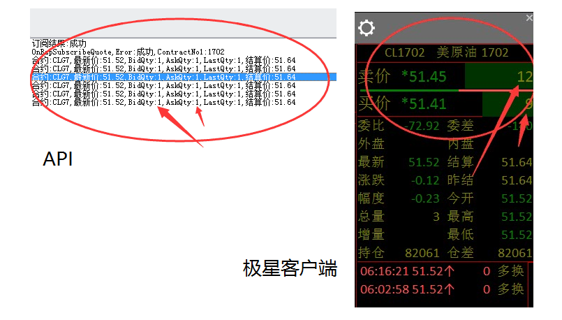

# 行情

----

# 如何订阅我想要的行情？

每个期货公司配置的品种代码可能不一样，因此建议通过QryContract接口查询服务器支持的合约列表。

然后根据OnRspQryContract返回的结果，通过SubscribeQuote接口进行订阅。

----

# 合约结构体里的合约代码1、合约代码2怎么理解？

**普通的期货、期权合约**，订阅时只需要一个合约。

这种情况只需填写：`合约代码1`、`执行价1`、`看涨看跌标示1`。

**跨期套利、跨品种套利类型的合约**，需要有两个合约。

这种情况下分别填写：`合约代码1`、`执行价1`、`看涨看跌标示1`，`合约代码2`、`执行价2`、`看涨看跌标示2`。

**注意：**当只有1个合约时，`看涨看跌标示2` 要设置为 TAPI_CALLPUT_FLAG_NONE 。

----

# 有很多合约需要订阅，能否批量订阅？

不能一次订阅多个合约，可多次调用SubscribeQuote接口来订阅多个合约。

所有订阅过的合约行情都会通过 OnRtnQuote 进行更新。

----

# 订阅行情出错，错误码72103或72104。

- 品种不存在（TAPIERROR_SUBSCRIBEQUOTE_COMMODITY_NOT_EXIST, 72103）
- 合约可能不存在（TAPIERROR_SUBSCRIBEQUOTE_CONTRACT_MAY_NOT_EXIST, 72104）

**详细解释：**

0. API初始化时，已经将服务器支持的品种信息与合约信息加载到本地。
0. 订阅行情时，与本地缓存数据进行比对，判断合约是否合法。
0. 如果品种不存在，直接报错，并不会向服务器发送数据。
0. 如果合约不存在，有可能是服务器暂时没有该合约，会向服务器发送订阅请求，同时通过错误码给出警告。

---

# 多次调用SubscribeQuote，报错"超过行情最大总订阅数(72001)"？

启明星API行情有最大订阅数量限制。

内盘不限制，外盘最多50个。

同一时间最多订阅50个外盘合约的行情，如果需要订阅新的合约，请退订之前的合约。

----

# 使用API订阅行情时，提示错误83001  不支持的行情协议

请升级TapQuoteAPI至9.3.0.0以上。

----

# 某些行情能收到推送，但是买卖价格和量跟易盛极星怎么不一样呢？

客户端显示带星号的是隐含价格、数量（可以在系统设置里关掉）。

隐含价格、数量目前主要存在于外盘行情，指的是非直接报单的价格、数量（比如价差单等）

按此价格下单，可以成交。具体规则以各个交易所规则为准。
